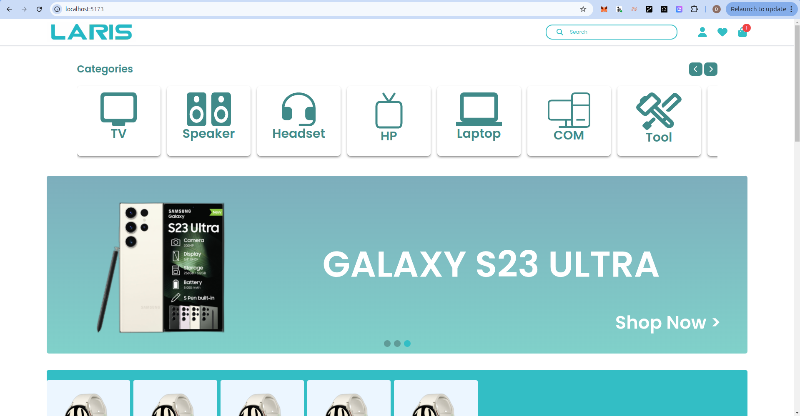
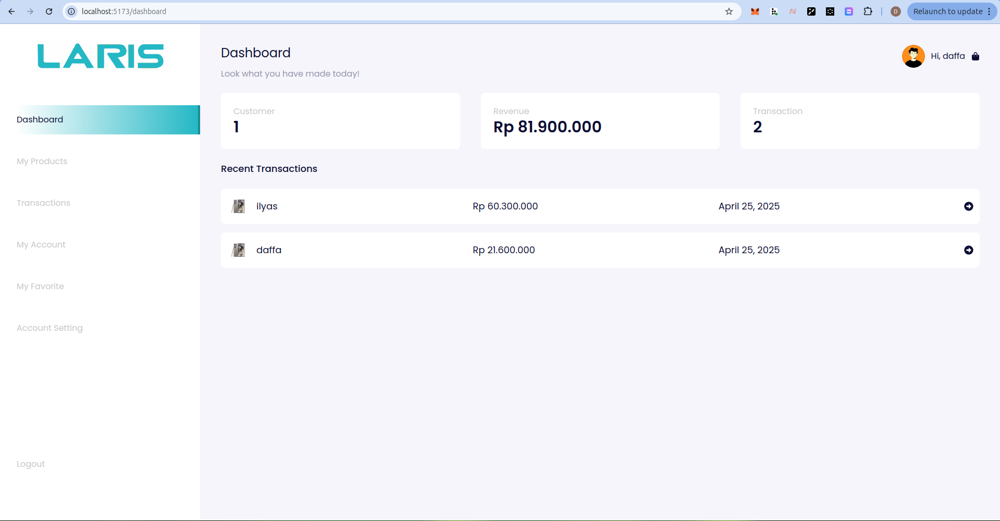

# MyTick frontend project

Laris Store is a modern e-commerce platform designed to simplify the buying and selling of electronic products such as smartphones, computers, TVs, and other electronic devices. This project is built with a frontend powered by ReactJS and Tailwind CSS, and a robust backend using Golang and PostgreSQL.

Laris Store allows users to browse a variety of electronic products, add items to their cart, proceed to checkout, and complete secure payments with ease. All these processes are supported by a stable and efficient backend system, ensuring a smooth and reliable shopping experience.


<p float="left" align="center">


</p>

Built using


## Getting Started

1. Clone this repository
```sh
git clone https://github.com/DaffaAbiyyuAtha/laris
cd laris
```
2. Open in VSCode
```sh
code .
```
3. Install npm
```sh
npm i
```
4. Run Project
```sh
npm run dev
```
5. Open your google chrome and you can view the project at http://localhost:5173/
6. If you want to run it full, I recommend running the backend https://github.com/DaffaAbiyyuAtha/go-laris

## Features

- <b>Purchase</b>: Users can buy item for selected product.
- <b>User Profile Management</b>: Users can manage their profile and view order history.
- <b>Create product</b>: Organizers can list their product with full details.
- <b>Add Whishlist</b>: Users can add wishlist product and see all this wishlist.

## Technologies Used

- <b>Tailwind CSS</b>: Utility-first CSS framework for styling the UI.
- <b>React.js</b>: A JavaScript library for building user interfaces.
- <b>Redux</b>: For managing state in large-scale applications.
- <b>Axios</b>: For making HTTP requests to the backend API.
